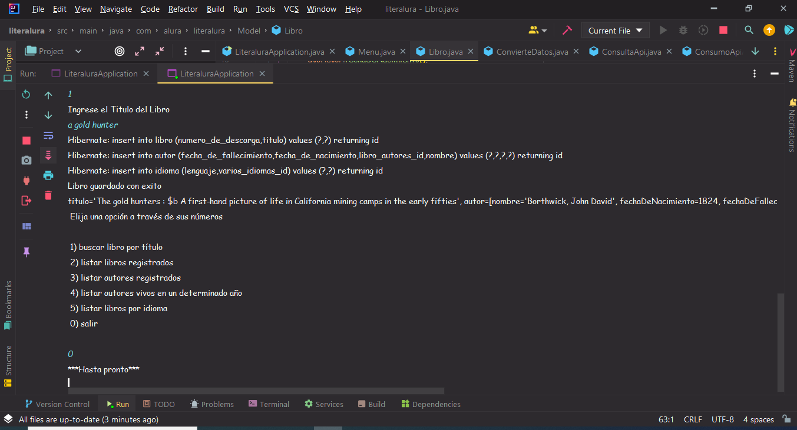

# Literalura

 Literalura/img_literalura.png
Lenguaje utilizado JAVA 
se utiliza API de libros "GUTENDEX"
se deserealiza y se utilizan los datos para guardarlos en Base de datos
se crea un menu y se manipula la base de datos
